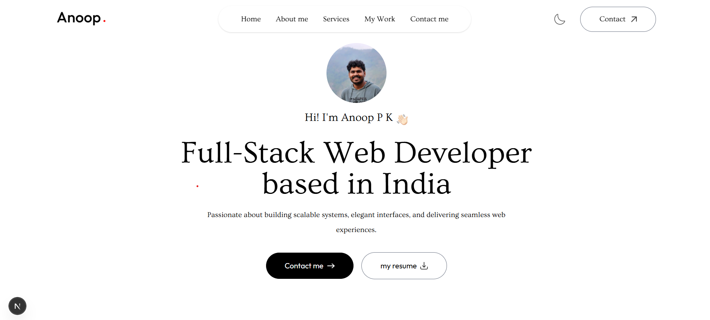

# Personal Portfolio Website

A modern, responsive portfolio website built with Next.js and Tailwind CSS, featuring a clean design, dark mode support, and smooth animations.



## 🌟 Features

- **Responsive Design**: Fully responsive layout that works on all devices
- **Dark Mode**: System-aware dark mode with manual toggle option
- **Smooth Animations**: Page transitions and scroll animations using Framer Motion
- **Contact Form**: Integrated contact form with Web3Forms API
- **Modern UI**: Clean and professional user interface with Tailwind CSS
- **Performance Optimized**: Built with Next.js for optimal performance
- **SEO Friendly**: SEO optimized with Next.js metadata

## 🛠️ Technologies Used

- **Framework**: Next.js 14 (React)
- **Styling**: Tailwind CSS
- **Animations**: Framer Motion
- **Form Handling**: Web3Forms API
- **Icons/Images**: Custom assets
- **Fonts**: Google Fonts (Outfit, Ovo)
- **Version Control**: Git
- **Deployment**: Vercel

## 🚀 Getting Started

### Prerequisites

- Node.js (v18 or higher)
- npm or yarn

### Installation

1. Clone the repository:
   ```bash
   git clone https://github.com/anoopaneesh/portfolio2.git
   ```

2. Navigate to the project directory:
   ```bash
   cd portfolio
   ```

3. Install dependencies:
   ```bash
   npm install
   # or
   yarn install
   ```

4. Create a `.env.local` file in the root directory and add your Web3Forms API key:
   ```env
   NEXT_PUBLIC_WEB3FORMS_KEY=your_api_key_here
   ```

5. Start the development server:
   ```bash
   npm run dev
   # or
   yarn dev
   ```

6. Open [http://localhost:3000](http://localhost:3000) in your browser to see the result.

## 📁 Project Structure

```
portfolio/
├── app/                    # Next.js app directory
│   ├── components/         # React components
│   ├── context/           # Context providers
│   ├── layout.tsx         # Root layout
│   └── page.tsx           # Home page
├── assets/                # Images and icons
├── public/                # Static files
├── styles/                # Global styles
└── tailwind.config.js     # Tailwind configuration
```

## 🎨 Customization

1. **Colors**: Edit `tailwind.config.js` to customize the color scheme
2. **Content**: Update components in `app/components/` to modify content
3. **Styles**: Modify global styles in `app/globals.css`
4. **Assets**: Replace images and icons in `assets/` directory

## 📱 Components

- **Navbar**: Responsive navigation with dark mode toggle
- **Header**: Hero section with profile information
- **About**: Personal introduction and skills
- **Experience**: Work history with animated cards
- **Services**: Services offered section
- **Work**: Portfolio projects showcase
- **Contact**: Contact form with email integration
- **Footer**: Social links and copyright

## 🤝 Contributing

Contributions, issues, and feature requests are welcome! Feel free to check [issues page](https://github.com/anoopaneesh/portfolio/issues).

## 📝 License

This project is [MIT](LICENSE) licensed.

## 👤 Contact

- Website: [Your Website](https://your-website.com)
- GitHub: [@anoopaneesh](https://github.com/anoopaneesh)
- LinkedIn: [Your Name](https://linkedin.com/in/anoop-pk)
